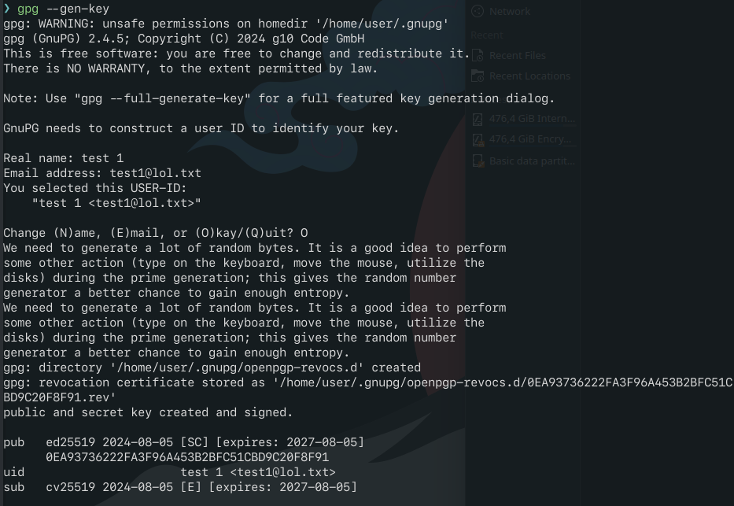
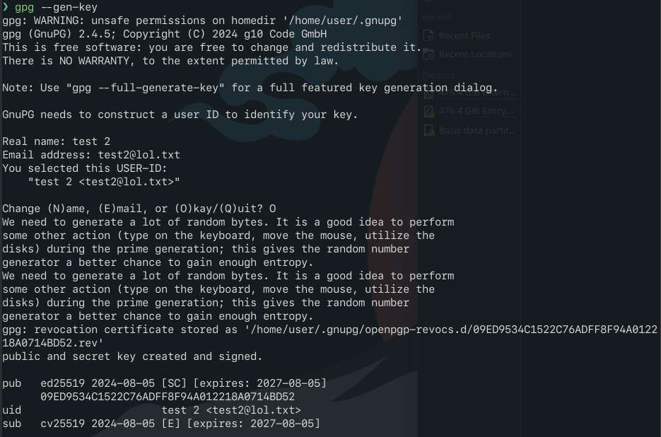
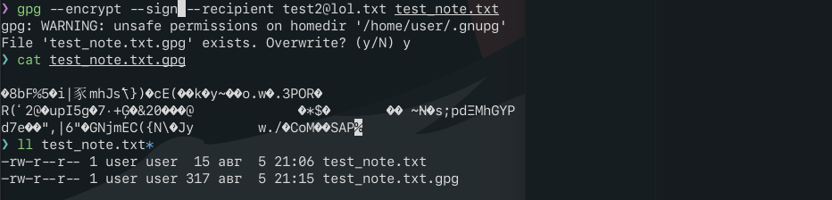
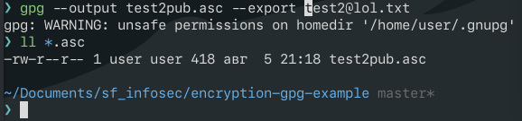

# GPG simple encryption example

## The Task

1. Установить GnuPG в разных системах.
2. Создать пару ключей № 1.
3. Создать пару ключей № 2 с указанием другой электронной почты.
4. Зашифровать любой файл с помощью закрытого ключа № 1 на открытом ключе № 2.
5. Расшифровать файл с помощью закрытого ключа № 2.

## Walkthrough

1. it is installed by default anyway but can be installed with:

```bash
sudo pacman -Sy --noconfirm gnupg
```

feel free to install on any number of your systems

2. creating keys:

```bash
gpg --gen-key
```



3. the same



4. encrypt [the file](./test_note.txt)


```bash
gpg --encrypt --sign --recipient test2@lol.txt test_note.txt
```



5. decrypt

to be able to receive encrypted response to your [message](./test_note.txt.gpg) you have to share pub key too, so ensure exporting it first

```bash
gpg --output test2pub.asc --export test2@lol.txt
```



then import

```bash
gpg --import test2pub.asc
```


then list keys (optional)

```bash
gpg --list-keys
```


then decrypt

```bash
gpg --decrypt test_note.txt.gpg
```


