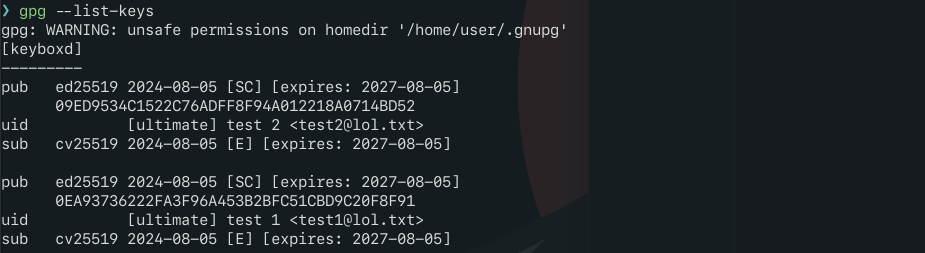

# GPG simple encryption example

## The Task

1. Установить GnuPG в разных системах.
2. Создать пару ключей № 1.
3. Создать пару ключей № 2 с указанием другой электронной почты.
4. Зашифровать любой файл с помощью закрытого ключа № 1 на открытом ключе № 2.
5. Расшифровать файл с помощью закрытого ключа № 2.

## Walkthrough

1. it is installed by default anyway but can be installed with:

```bash
sudo pacman -Sy --noconfirm gnupg
```

feel free to install on any number of your systems

2. creating keys:

```bash
gpg --gen-key
```


3. the same


4. encrypt [the file](./test_note.txt)

to be able to encrypt [message](./test_note.txt.gpg) for test2, test2 have to provide his public key, so let's export it

```bash
gpg --output test2pub.asc --export test2@lol.txt
```


then we need to import it before encrypting

```bash
gpg --import test2pub.asc
```


then list keys to check (optional)

```bash
gpg --list-keys
```



now - encrypt the [message](./test_note.txt.gpg)


```bash
gpg --encrypt --sign --recipient test2@lol.txt test_note.txt
```


5. decrypt

```bash
gpg --decrypt test_note.txt.gpg
```


